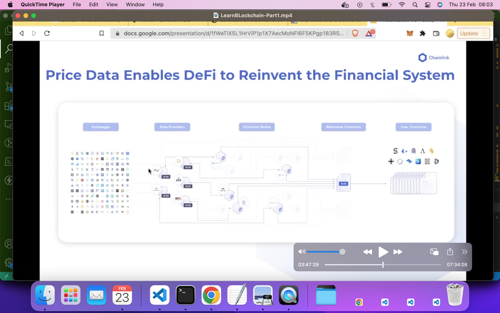

## Lesson 4: Remix Fund Me (Part 1: 03:31:56)
#### Sending ETH through A function and Reverts  (03:33:21)
__Transaction Fields__   
Every single transaction will have these fields
* __Nonce__: tx count for the account
* __Gas Price__: price per unit of gas (in wei)
* __Gas Limit__: max gas that this tx can use
* __To__: address that the tx is sent to
* __Value__: amount of wei to sent
* __Data__: what to send to the To address
* v, r, s: components of tx signature  

Smart contracts can hold funds just like wallets can.   
When you deploy a contract, you get a contract address much that same as a wallet address.   
Money math is done in terms on Wei, so 1 ETH = 1e18 Wei. See [Ether Converter](eth-converter.com) for conversion factors between the units.   

__Revert__  
When a transaction is reverted, it undo any previous action and sends the remaining gas back. A revert operation is often triggered by a failed _require_ statement.  
```
// Will revert if the condition in the require statement is not met.
require(msg.value >= minimumUsd, "You didn't sent enough!");
```  

__The Oracle Problem__  
Smart contracts are unable to connect with external systems, data feeds, APIs, existing payment systems or any other off-chain resources on their own. Also blockchain can't do any external computation.  
This is because blockchains are deterministic by design.   
This is also known as the _Smart contract connectivity problem_.  

__Block chain Oracle__   
A block chain oracle is any device that interacts with the off-chain world to provide external data or computation to smart contracts.

__Centralized Oracle__  
A centralized node should be avoided because it defeats the purpose of blockchain and reintroduces a single point of failure. For this reason, a decentralized oracle network is prefered.

__Chain link__   
Chainlink is a Decentralized Oracle Network for bringing data and external computation into our smart contract. This give rise to hybrid smart contracts that combine on-chain and off-chain to make feature reach application.

__Checklink Features__  (Part 1: 03:47:29)
1. __Chainlink data feed__  
Chainlink data feed provides a decentralized data source to your Defi application.  
For example, you can get price data over a network of _exhanges_ which delivers data to _Data providers_ and then to _Chainlink Nodes_ which are then delivered to your contract through a _Reference contract_, _Pricing contract_ or _Data contract_.   
The addresses for your price feeds can be found on [Price Feed Contract Addresses](https://docs.chain.link/data-feeds/price-feeds/addresses) page.  
For Goerli testnet see [Goerli testnet contract addresses](https://docs.chain.link/data-feeds/price-feeds/addresses?network=ethereum#Goerli%20Testnet)
2. __Chainlink VRF__  
Block chains are deterministic systems which means they can't have randomness.  So to get random numbers we need to look outside of the blockchain.  
Chainlink _Verifiable Randomness Function_ is a way to get provable random number into our smart contracts.  See [random number example](https://docs.chain.link/vrf/v2/subscription/examples/get-a-random-number) to how get a provable random number into your application.  
3. __Chainlink Keepers__   
Decentralized event driven execution.  
Chainlink keepers are Chain link nodes that listen to a registration contract for different events that you specify to fire.  Maybe you say every 10 minutes, you want to do something or if the price of an assets hits a number, do something.   
Once a trigger returns true, chain link node will then perform whatever action that you tell the chain link node to do.  
4. __End-to-end reliaibility__  
End-to-end reliability is the promise of smart contracts.  
5. __Chainlink  to any API__   
__How chainlink data feed work__  
A network of chainlink nodes gets data from different exchanges and data providers and brings that data through a network of decentralized chainlink nodes.   
The chainlink nodes use a medium to figure out what the actual price of the asset is and deliver that in a single transaction to a _Reference contract_, _PriceFeed contract_ or  _Data contract_ on chain so that other contracts can use.  
For live example see [Chainlink Data](https://data.chain.link) for price feeds.   
  

__Example on chainlink data feed__   
1. Go to [Chain link docs](https://docs.chain.link/data-feeds/using-data-feeds) and scroll down to the solidity sample contract.  
2. Click on the _Open in Remix_ button to open up the smart contract in Remix. Compile the contract.
3. Make sure you have enough ETH on your MetaMask account.  
4. Switch the deployment Environment to _Injected provider_. We cannot use JavaScrip VM because there is no network of Chainlink nodes watching the JavaScript VM.
5. You Meta mask account should now be selected.
6. Click the deploy button. You MetaMask will popup asking you to confirm the transaction.  
7. Scroll down to the deployed contract and click the _getPrice_ button to trigger the _getPrice_ function in the SmartContract.  

__Problem with Decimal numbers in Solidity__   
Decimals do not work very well in Solidity. For this reason the decimal of a decimal number may be omitted thus presenting the number as a larger number than it actually is. For example 3262.81237684 may be presented as 326281237684.  


#### Review of Sending ETH And working with Chainlink (04:00:31 - 04:01:53)  

#### Interfaced and Price feed (04:01:54 - 04:09:10)

#### Importing from Github and NPM (04:09:11 - 04:11:08)
See [Chanlink Example Codes](https://github.com/smartcontractkit/chainlink)  
See [AggregatorV3Inteface](https://github.com/smartcontractkit/chainlink/blob/develop/contracts/src/v0.8/interfaces/AggregatorV3Interface.sol)   

If you compile an interface, you will actually get the ABI of the contract because it defines all the different ways we can interact with the contract.

#### Floating point Math in Solidity (04:11:09 - 04:21:59)  

#### Basic Solidity Arrays and Structs 2 (04:22:00 - 04:23:51)  

#### Review Interfaces, Github imports and Math in Solidity (04:23:52 - 04:29:54)

#### Safe Math Overflow checking and the "Unchecked" keyword (04:29:55 - 04:34:30)
Prior to version 0.8.x of solidity, there was no checking for overflow or underflow for values of integer data type. But from 0.8.x version, overflow and underflow are checked and an error is thrown when it occurs.  

The _uncheck_ keyword is used to stop Solidity from checking and throwing error when an overflow occurs.
```
uint8 bigNumber = 255;
uncheck{bigNumber = bigNumber + 1;}
```
In this code, Solidity will not check for overflow or through an error because of the use of the _uncheck_ keyword. Instead an overflow will occur silently making bigNumber become 0.
The use of the _uncheck_ keyword can make a smart contract gas efficient.  

Check out the [SafeMath](https://github.com/OpenZeppelin/openzeppelin-contracts/blob/master/contracts/utils/math/SafeMath.sol) library.  

#### Solidity basics for loop (04:34:31 - 04:42:00)

#### Basic Solidity Reseting an Array (04:42:01 - 04:42:35)

#### Sending ETH from a contract (04:42:36 - 04:5025)
There 3 ways to send ether to the caller account.
1. Transfer: If there is a failure, it throw an error
2. Send: If there is a failure it returns false. You may need to add a require statement if you want it to fail with an error.  
3. Call

#### Basic Solidity Constructor (04:50:26 - 04:53:19)

#### Basic Solidity Modifier (04:53:20 - 04:56:34)

#### Testnet Demo (04:56:35 - 05:04:33)

#### Advanced Solidity Concept (05:04:34 - 05:05:41)

#### Advanced Solidity Immutable and Constants (05:05:42 - 05:12:56)
The use of _constant_ and _immutable_ keywords for your variable where applicable can lead to gas savings.   
The use of custom errors instead of _require_ statements also helps in gas savings.  

After you become proficient in smart contract development, you can begin working on gas optimization in your code.

#### Advanced Solidity Custom Errors (05:12:57 - )

#### Advanced Solidity Receive and Callbacks (05:15:45 - )
__Resources__  
[Ethereum unit converter](https://eth-converter.com)   
[solidity-by-example.org](https://solidity-by-example.org/)  
[github.com/OpenZeppelin/openzeppelin-contracts](https://github.com/OpenZeppelin/openzeppelin-contracts)  
[github.com/smartcontractkit/chainlink/](https://github.com/smartcontractkit/chainlink/)   
[Solidity Library](https://solidity-by-example.org/library/)  
[Sending ether](https://solidity-by-example.org/sending-ether/)   
